# WellNash

## Introduction
WellNash is an automated workout generator tailored for the Utown gym at the National University of Singapore (NUS). This application customizes workout routines based on workout duration, past performances, injuries, and the gym equipment available.

## Features
- **User Authentication:** Implemented using Supabase Authentication to manage user access.
- **Custom Workout Generation:** Automatically generates workouts based on user profiles.
- **Injury Management:** Provides injury-conscious workout recommendations.
- **Performance Tracking:** Integrates with fitness tracking data to adapt workouts to user progress.
- **Workout Customisation:** Ability to edit workouts (add set, exercise) and allows for rest in between exercises as well
- **Workout Log:** Ability to access past workouts and data to observe progress 


## Technology Stack
- **Flutter:** For cross-platform mobile application development.
- **Supabase:** Provides backend services including authentication, database management, and hosting.
- **Dart:** The programming language used for developing the application.

# How to Run the App

Ensure that you have Flutter installed on your console.

To install Flutter, follow these steps:

### On macOS
```brew install --cask flutter```

### On Windows
```choco install flutter```

### On Linux
```sudo snap install flutter --classic```

## Install Dependencies
```flutter pub get```

## Run Flutter
```flutter run```

If you are using the iOS emulator, ensure that you use R (hot restart) or Q (Quit) if the app is not functioning.

# App Walkthrough

## Sign Up and Sign In Procedure

When you open the app, you are welcomed with a sign in page. If the user has not created an account, they can click the sign up button.

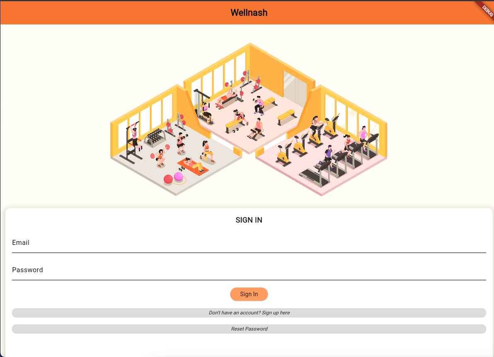

Upon clicking the sign up button, you are redirected to the sign up page, which asks for your username, email and password. Using Supabase's Password and Email Authentication
system, we are able to prompt the user to provide us with valid credentials. These details are stored in a new User instance in our database

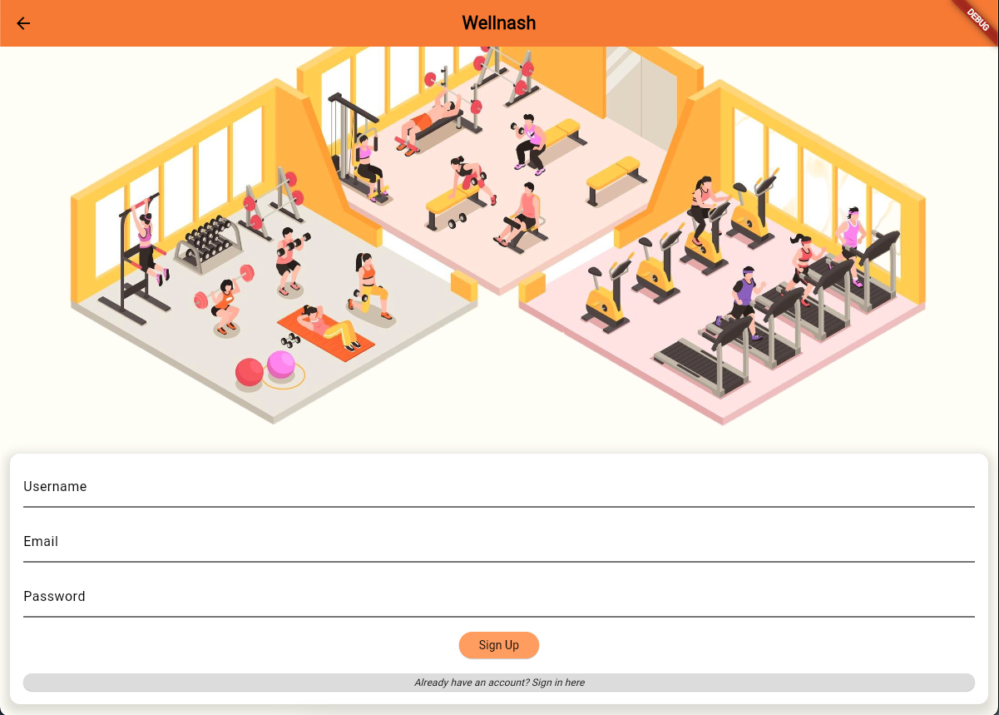

Upon signing up, you are then asked for relevant body details, your workout goal and your recent activity level. These values are stored in the User instance as well,
and are crucial in generating relevant workouts for the user.

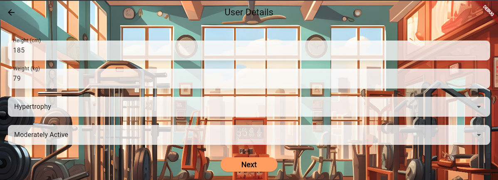

The user is then prompted for the number of days in a week that they are able to workout, and their preferred workout split

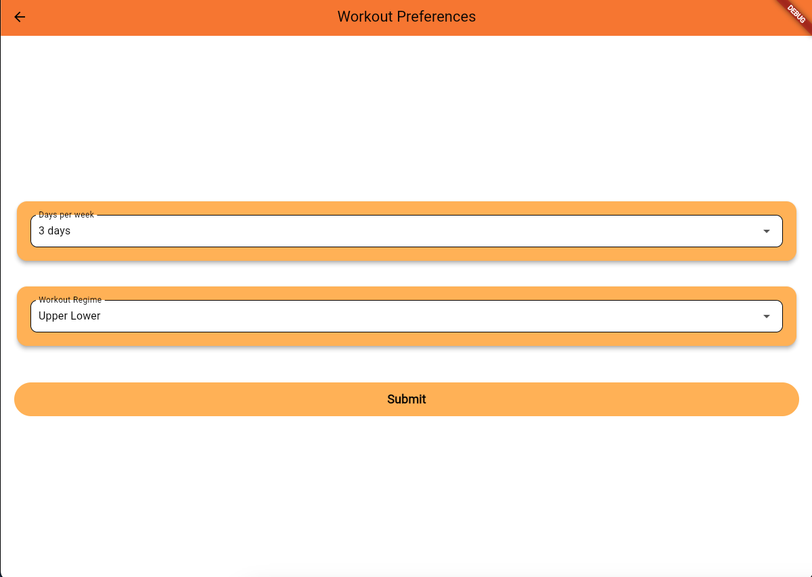

After this, voila! You are done with the sign up process. 

## Home Page

This is where the user is directed once they sign in to an existing account. As you can see, they are greeted with a widget that welcomes them (with their username included) and a full body
muscular diagram that highlights the targeted muscles for the day (still working on this). By clicking on Start Workout, they are able to start their workout for the day.

They can also toggle to two other screens, their workout history and their user profile.

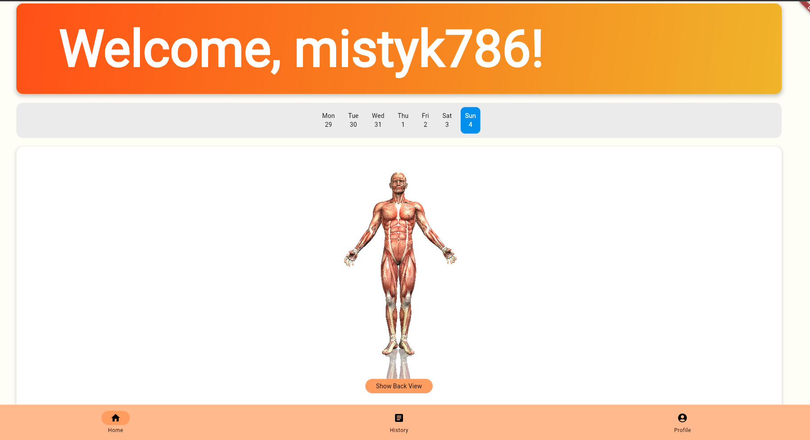 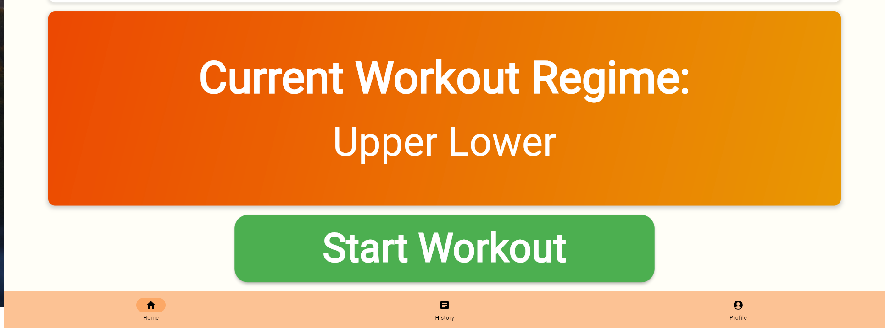

## User Profile 

This is the User Profile page, where users can change their info and also add to it with our Select Injuries feature. These injuries are accounted for when the user generates their workout
ruling out activities/exercises that use the bodyparts affected by the injury.

The user is also able to sign out from this page

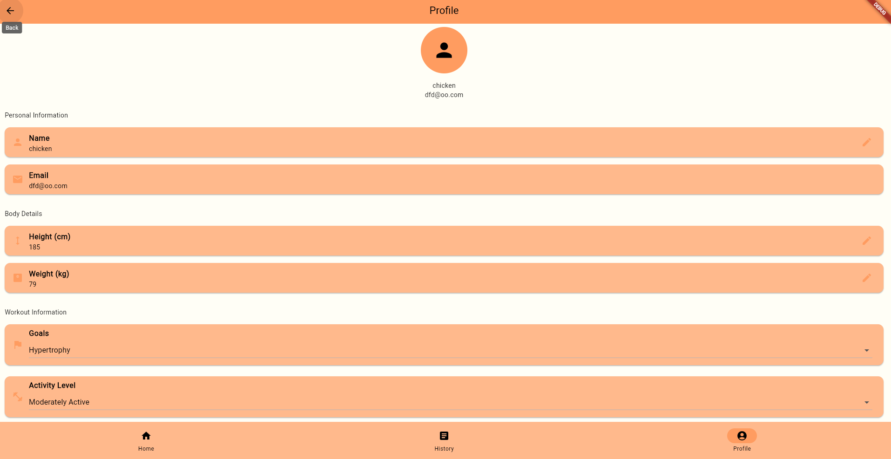 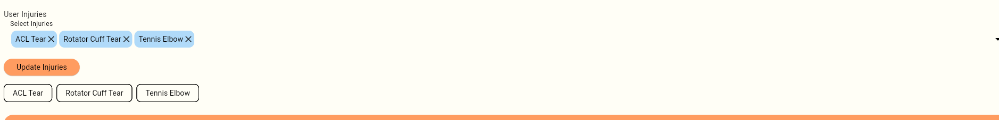

## Workout History

Moving on, this is the Workout History Page! The user can navigate through the calendar to look at their past workouts. These workout are all logged in our database so that they can be used 
for workout generation to provide the user with an accurate and sufficiently challenging workout based on progressive overload.

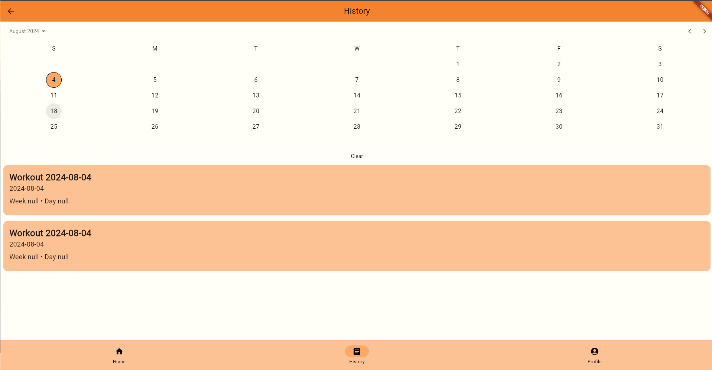 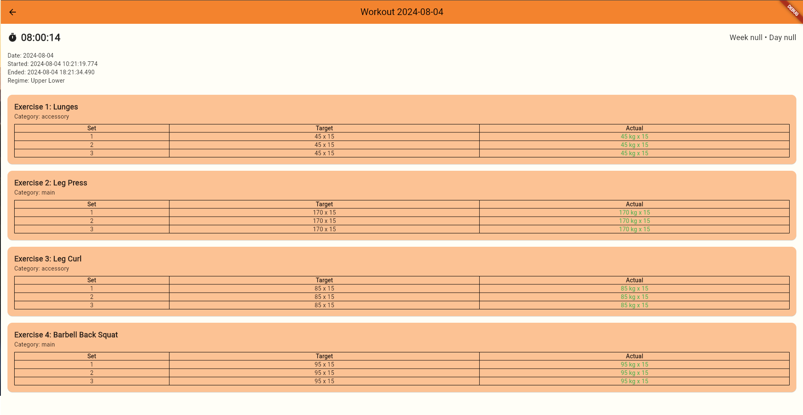

## Generating Workout

Lastly, and most importantly, let's look at how workouts are generated. After clicking the start workout button on the home screen, the user is brought to these two pages, to select their gym
and the length of their workout. Both of these details are crucial. Currently, we have created UTown Gym as the only option but this allows us to know exactly which machines/weights are available,
ensuring that the workout that is generated is feasible. The length of the workout determines how many sets and exercises the user will be given.

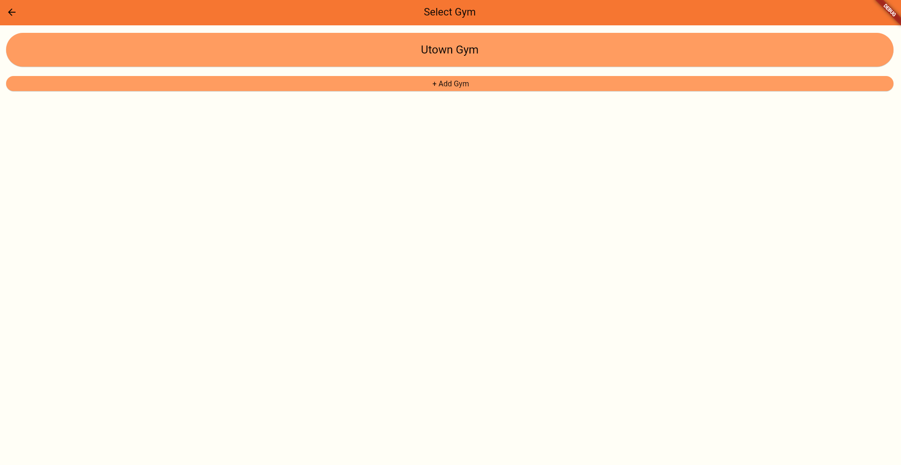 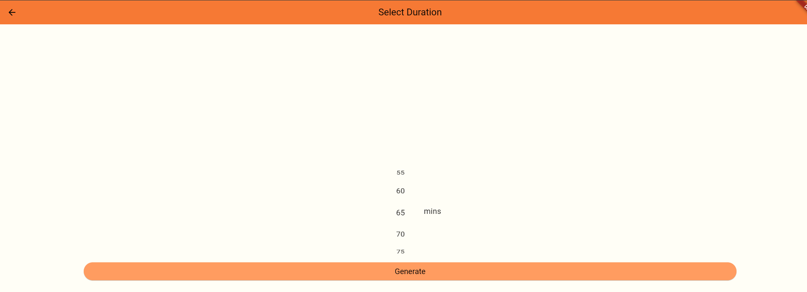

After inputting all relevant details, the user is able to receive their workout. Their workout regiment is generated through an Anthropic API service. The model is given a set prompt which is customised with the user's details, past workouts, injuries, workout length, gym etc. These details are used to generate a relevant workout and returned back to our database to present to the user.

The user is then presented with their workout for the day. As you can see from the image, it contains a number of different exercises, sets and weights that are relevant to the user. The user is able
to follow the target weights for their own workout. If they are able to meet this target, they can press the tick button (next to the weight column) to autofill their details. Otherwise, they can also
manually input their actual set and weight count. 

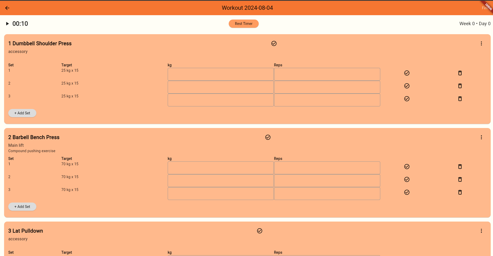

The user is also able to add/delete sets and exercises, and also use our rest timer to pause their workout.

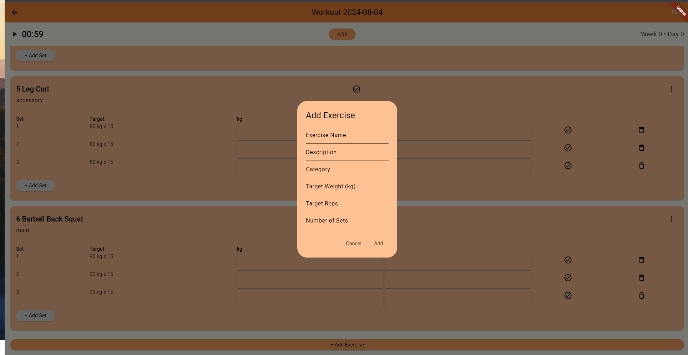 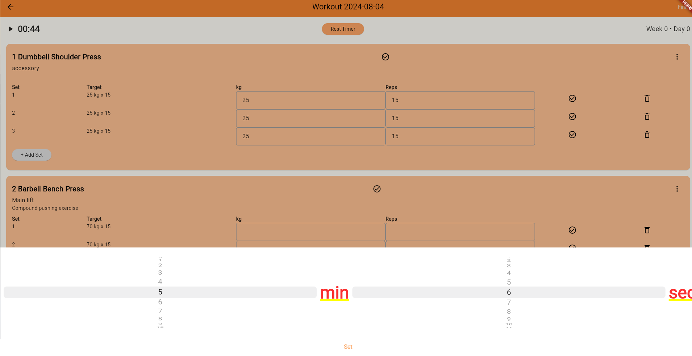

Once the user is done with their workout, they can press the finish workout button which redirects them back to the home screen. Their workout is stored in their workout logs and can be checked in their
workout history.

## Contact
For more information, questions, or feedback, please contact us at [avimcm77@gmail.com]
